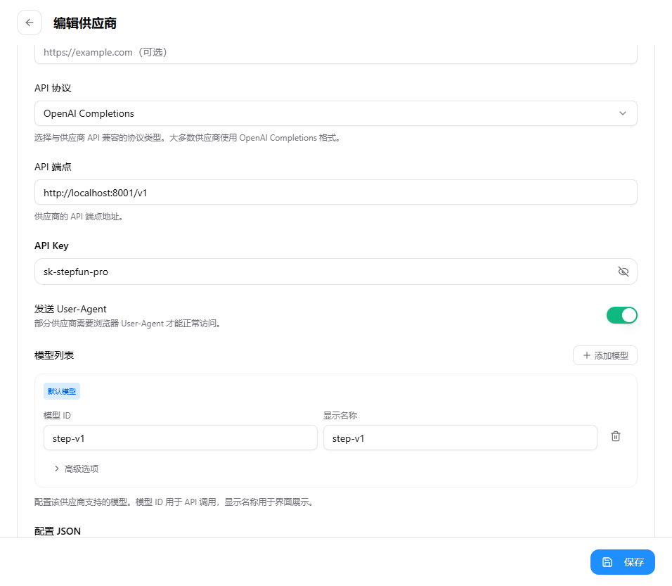

# step-free-api

将 [StepFun](https://www.stepfun.com/chats/new) 网页版接口转换为 OpenAI 兼容的 API 服务。

**支持特性：**
- ✅ OpenAI Chat Completions API 兼容（`/v1/chat/completions`）
- ✅ Claude Messages API 兼容（`/v1/messages`，可直接对接 Claude Code）
- ✅ 流式输出（SSE）
- ✅ 多轮对话
- ✅ 联网搜索
- ✅ 文件 / 图像解析
- ✅ Function Calling / Tool Use
- ✅ 多账号轮询 + API Key 管理
- ✅ 浏览器模式（绕过风控）

---

## 目录

- [获取 Token](#获取-token)
- [快速启动](#快速启动)
- [认证方式](#认证方式)
- [API 接口](#api-接口)
- [环境变量](#环境变量)
- [配置文件](#配置文件)
- [接入第三方客户端](#接入第三方客户端)
- [实现原理](#实现原理)
- [免责声明](#免责声明)

---

## 获取 Token

1. 打开 [stepfun.com](https://www.stepfun.com/chats/new) 并登录
2. 按 `F12` 打开浏览器开发者工具
3. 在 **Application → Local Storage** 中找到并复制 `deviceId` 的值
4. 在 **Application → Cookies** 中找到并复制 `Oasis-Token` 的值
5. 将两者用 `@` 拼接：`{deviceId}@{Oasis-Token}`

> 这个字符串即为调用 API 时使用的 Token（refresh_token）。

---

## 快速启动

> **注意：** 本项目需要使用**浏览器模式**才能正常对话。浏览器模式通过 Playwright 驱动真实浏览器与 StepFun 交互，非浏览器模式（直接 HTTP）目前无法正常收发消息。

### 本地运行（浏览器模式）

```shell
npm install
npm run build
set STEPFUN_BROWSER_MODE=1&& node dist/index.js    # Windows
# 或
STEPFUN_BROWSER_MODE=1 node dist/index.js          # Linux / macOS
```

### 开发模式（含热重载）

```shell
npm run dev:browser
```

默认监听端口由 `configs/dev/service.yml` 控制（默认 `8001`）。

### Docker

```shell
docker run -d --init --name step-free-api \
  -p 8001:8001 \
  -e STEPFUN_BROWSER_MODE=1 \
  vinlic/step-free-api:latest
```

> Docker 镜像需包含 Playwright 浏览器依赖，请确认镜像版本支持浏览器模式。

### 验证服务

```shell
curl http://localhost:8001/ping
# 返回 "pong"
```

---

## 认证方式

所有接口均通过 `Authorization` 请求头传入凭证。

### 推荐方式：编辑 config/api.json（直接配置）

在 `config/api.json` 中填写账号信息和 API Key：

```json
{
  "admin_key": "your-admin-key",
  "api_keys": {
    "sk-your-key": {
      "name": "账号备注",
      "accounts": [
        {
          "device_id": "你的deviceId",
          "oasis_token": "你的Oasis-Token"
        }
      ]
    }
  }
}
```

填好后调用接口时直接使用：

```
Authorization: Bearer sk-your-key
```

多账号只需在 `accounts` 数组中添加多个对象，服务会自动轮询。

### 兼容方式：直接使用 refresh_token

也可以将 `deviceId` 和 `Oasis-Token` 用 `@` 拼接后直接作为 Bearer Token：

```
Authorization: Bearer {deviceId}@{Oasis-Token}
```

多账号逗号分隔，自动轮询：

```
Authorization: Bearer token1,token2,token3
```

---

## API 接口

### POST /v1/chat/completions

兼容 OpenAI [Chat Completions API](https://platform.openai.com/docs/guides/text-generation/chat-completions-api)。

```shell
curl http://localhost:8000/v1/chat/completions \
  -H "Authorization: Bearer YOUR_TOKEN" \
  -H "Content-Type: application/json" \
  -d '{
    "model": "step",
    "messages": [{"role": "user", "content": "你好"}],
    "stream": false
  }'
```

**支持参数：**

| 参数 | 说明 |
|------|------|
| `model` | 模型名，填 `step` 或 `step-v1` 即可 |
| `messages` | 对话历史，兼容 OpenAI 格式 |
| `stream` | `true` 启用 SSE 流式输出 |
| `tools` | Function Calling 工具定义（OpenAI 格式） |
| `use_search` | `false` 关闭联网搜索（默认开启） |

**文件 / 图像解析：**

在 `content` 中传入多模态内容：

```json
{
  "model": "step",
  "messages": [{
    "role": "user",
    "content": [
      {"type": "file", "file_url": {"url": "https://example.com/doc.pdf"}},
      {"type": "text", "text": "总结这份文档"}
    ]
  }]
}
```

也兼容 OpenAI `image_url` 格式传图片。

---

### POST /v1/messages

兼容 Anthropic [Messages API](https://docs.anthropic.com/en/api/messages)，可直接对接 **Claude Code** 等工具。

支持的 Claude 模型别名（均映射至 `step-v1`）：

| 别名 | 映射 |
|------|------|
| `claude-sonnet-4-5 / 4-6 / 4-7` | `step-v1` |
| `claude-opus-4-5 / 4-6 / 4-7` | `step-v1` |
| `claude-haiku-4-5` | `step-v1` |
| `claude-3-5-sonnet-latest` | `step-v1` |

```shell
curl http://localhost:8000/v1/messages \
  -H "Authorization: Bearer YOUR_TOKEN" \
  -H "Content-Type: application/json" \
  -d '{
    "model": "claude-sonnet-4-6",
    "messages": [{"role": "user", "content": "你好"}],
    "max_tokens": 1024
  }'
```

---

### GET /v1/models

返回可用模型列表。

---

### POST /v1/upload/file

上传本地文件至 StepFun，获取文件 URL 用于后续对话引用。

```shell
curl http://localhost:8000/v1/upload/file \
  -H "Authorization: Bearer YOUR_TOKEN" \
  -F "file=@/path/to/document.pdf"
```

### POST /v1/upload/url

通过远程 URL 上传文件。

```json
{ "url": "https://example.com/document.pdf" }
```

---

### POST /token/check

检测 refresh_token 是否仍有效。

```json
{ "token": "deviceId@Oasis-Token" }
```

响应：

```json
{ "live": true }
```

---

## 环境变量

| 变量 | 说明 | 默认值 |
|------|------|--------|
| `SERVER_PORT` | 服务监听端口 | `8000` |
| `SERVER_HOST` | 服务监听地址 | `0.0.0.0` |
| `SERVER_ENV` | 运行环境（对应 `configs/` 下目录名） | `dev` |
| `STEPFUN_BROWSER_MODE` | 设为 `1` 启用浏览器模式 | 未设置 |
| `STEPFUN_ALLOW_AGENT_TOOLS` | 设为 `1` 允许 agent/explore 工具 | 未设置 |
| `STEPFUN_CURRENT_INPUT_FILE_MIN_CHARS` | 历史记录写入文件的最小字符数 | `0` |
| `STEPFUN_CURRENT_INPUT_LIVE_MAX_CHARS` | 历史记录文件最大字符数 | `20000` |
| `STEPFUN_CONVERSATION_CREATE_MIN_DELAY_MS` | 创建会话最小间隔（ms） | `1000` |
| `STEPFUN_CONVERSATION_CREATE_MAX_DELAY_MS` | 创建会话最大间隔（ms） | `3000` |

---

## 配置文件

### configs/{env}/service.yml

服务监听配置：

```yaml
name: step-free-api
host: '0.0.0.0'
port: 8000
```

### configs/{env}/system.yml

系统行为配置：

```yaml
requestLog: false      # 是否打印每条请求日志
tmpDir: ./tmp          # 临时文件目录
logDir: ./logs         # 日志目录
tmpFileExpires: 86400000  # 临时文件有效期（ms）
```

### config/api.json

API Key 与账号信息配置文件，直接手动编辑即可：

```json
{
  "admin_key": "your-admin-key",
  "api_keys": {
    "sk-example": {
      "name": "示例账号",
      "accounts": [
        {"device_id": "xxx", "oasis_token": "yyy"}
      ]
    }
  }
}
```

---

## 接入第三方客户端

### OpenClaw

1. 打开 OpenClaw → **设置** → **供应商配置** → **添加供应商**

   

2. 填写以下信息：

   | 字段 | 值 |
   |------|-----|
   | **API 协议** | `OpenAI Completions` |
   | **API 端点** | `http://localhost:8001/v1` |
   | **API Key** | 你的 Token 或已创建的 API Key（如 `sk-stepfun-pro`） |

3. 在 **模型列表** 中点击 **添加模型**，**模型 ID** 可填写以下任意一个：

   | 模型 ID | 说明 |
   |---------|------|
   | `step-v1` | 原生模型名 |
   | `step-v1-vision` | 原生模型名（视觉） |
   | `claude-opus-4-5` / `claude-opus-4-6` / `claude-opus-4-7` | Claude Opus 别名 |
   | `claude-sonnet-4-5` / `claude-sonnet-4-6` / `claude-sonnet-4-7` | Claude Sonnet 别名 |
   | `claude-haiku-4-5` | Claude Haiku 别名 |
   | `claude-3-5-sonnet-latest` | Claude 3.5 Sonnet 别名 |
   | `claude-3-opus-latest` | Claude 3 Opus 别名 |

   > 所有 Claude 别名均映射到 `step-v1`，填哪个效果相同，按需选择即可。

4. 保存后即可在对话界面选择该供应商和模型使用。

> **配置 JSON 示例（供参考）：**
> ```json
> {
>   "api": "openai-completions",
>   "apiKey": "sk-stepfun-pro",
>   "baseUrl": "http://localhost:8001/v1",
>   "models": [
>     {
>       "id": "claude-opus-4-6"
>     }
>   ]
> }
> ```

---

## 实现原理

本项目是一个 **API 代理层**，将 StepFun 网页端内部接口封装为标准 OpenAI / Anthropic API 格式：

1. **认证** — 使用 `deviceId` + `Oasis-Token` 调用 StepFun 的 RefreshToken 接口，换取有效期内的 `access_token`（缓存 15 分钟）
2. **会话** — 每次请求创建临时对话会话，对话结束后自动清理
3. **流式响应** — 对接 StepFun 的 protobuf 流式接口，实时转换为 SSE 格式返回
4. **多轮对话** — 将历史消息序列化为文件上传，以此实现上下文传递
5. **工具调用** — 通过 DSML 标签将工具描述注入提示词，解析模型输出并还原为 OpenAI `tool_calls` / Anthropic `tool_use` 格式
6. **浏览器模式** — 使用 Playwright 驱动真实浏览器进行交互，用于规避风控

---

## 免责声明

- 本项目仅供学习与技术研究，请勿用于任何商业或违法用途
- 使用本项目造成的任何后果由使用者自行承担
- 本项目与 阶跃星辰 无任何关联
