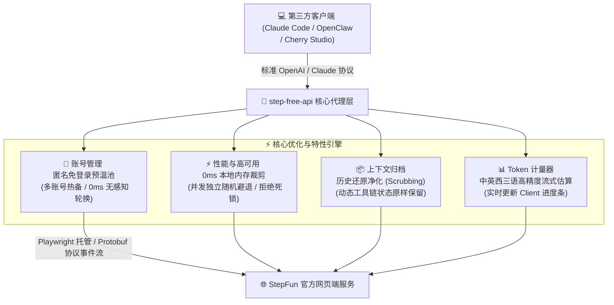

# 🚀 step-free-api

`step-free-api` 是一个专为追求卓越性能与稳定性的开发者设计的高性能 API 代理服务。它能够将 **StepFun (阶跃星辰)** 网页端的强大能力，零成本且优雅地转换为完全兼容 **OpenAI** 和 **Anthropic Claude** 标准协议的 API 服务。

通过本项目，您可以无缝将 StepFun 极具性价比的超长上下文（原生长达百万字）与多模态解析能力直接接入到 **Claude Code**、**OpenClaw (CCSwitch)**、**Cherry Studio**、**LobeChat** 等各类强大的第三方客户端及智能体开发框架中。

---

## ✨ 核心特性与技术优势

为了应对高并发、大上下文的复杂生产/开发环境，本项目进行了深度的架构重构与性能打磨，具备以下独特优势：

### 🎯 完美的协议兼容
* **OpenAI 兼容**：完美支持 Chat Completions API (`/v1/chat/completions`)。
* **Anthropic 兼容**：完美支持 Claude Messages API (`/v1/messages`)，可直接对接 **Claude Code** 终端编码助手。
* **流式与多模态**：支持原生 SSE 流式打字机输出、多轮对话、Function Calling / Tool Use（工具调用）。

### ⚡ 革命性的性能与抗压设计
* **彻底告别网络总结死锁**：放弃传统的外部大模型总结接口，改用**本地 0ms 高性能内存裁剪与智能截断**。彻底解决网络抖动或大模型总结自身挂死导致的任务排队死锁。
* **非阻塞独立随机退避**：移除全局 Promise 串行排队锁，每个请求在高频或被风控重试时使用独立随机避退时间，彻底阻断雪崩级排队延迟。
* **动态工具上下文原样保留**：智能重构并归档超长历史，保留最新提问后的工具链状态，彻底打破 Planner 类型智能体（如 Claude Code）因丢失上下文而陷入的工具无限重复调用死循环。

### 🔑 零门槛匿名池（强力推荐 🌟）
* **免账号极速使用**：内置 0 门槛免登录匿名模式，无需手动抓取 Token，开箱即用。
* **后台预注册与账号池预热**：服务会在后台自动注册、预热并维护一个多账号轮转的匿名账号池，轮换时间为 0ms，提供极高的防封与抗压弹性。

### 📊 真实的 Token 动态计量
* **拒绝虚假计量**：针对 OpenClaw、Cherry Studio 等客户端的 `context used` 比例显示进行了重构。
* **高精度双语 Tokenizer**：内置高精度中英西混合 Token 测算器（中文按 `1.3 tokens/字`，英文按 `0.35 tokens/词` 实时估算），在对话时可观察到客户端的 Token 进度条灵动且极度精准地伴随实际对话增长。

---

## 📅 快速启动

> [!IMPORTANT]
> **运行环境要求：**
> 1. 本项目强烈建议开启 **浏览器托管模式 (Browser Mode)**，这样可以最稳妥地规避各类网页端的高级风控与人机校验。
> 2. 您的本地系统需要安装 **Node.js (v16+)**。

### 方式 A：免登录匿名池模式 (极简推荐 ✨)

您不需要手动去抓取任何 Cookie 或 DeviceId。启动后，服务会自动使用预热池中的匿名凭证，并在过期前在后台无缝平稳轮换。

```bash
# 1. 克隆项目并安装依赖
npm install

# 2. 编译 TypeScript 代码
npm run build

# 3. 运行匿名免登录开发服务 (自带热重载)
npm run dev:anon

# 生产环境启动 (Windows PowerShell / CMD)：
$env:STEPFUN_ANONYMOUS_MODE="1"; $env:STEPFUN_BROWSER_MODE="1"; node dist/index.js

# 生产环境启动 (Linux / macOS)：
STEPFUN_ANONYMOUS_MODE=1 STEPFUN_BROWSER_MODE=1 node dist/index.js
```

---

### 方式 B：配置自有账号模式 (适合多账号轮询与持久会话)

如果您希望使用自己注册的 StepFun 官方账号以保留云端历史或获取更高的额度：

1. 打开并登录 [StepFun 官网](https://www.stepfun.com/chats/new) 网页端。
2. 按下 `F12` 打开浏览器开发者工具，进入 **Application (应用) → Cookies** 复制 `Oasis-Token`；并在 **Local Storage (本地存储)** 中复制 `deviceId`。
3. 手动编辑或创建项目根目录下的 `config/api.json`，格式如下：
   ```json
   {
     "admin_key": "your-admin-key",
     "api_keys": {
       "sk-stepfun-pro": {
         "name": "我的主账号",
         "accounts": [
           {
             "device_id": "抓取的 deviceId",
             "oasis_token": "抓取的 Oasis-Token"
           }
         ]
       }
     }
   }
   ```
4. 启动服务：
   ```bash
   npm run dev:browser
   ```

---

## ⚙️ 环境变量配置手册

您可以通过创建 `.env` 文件或在启动脚本中注入以下环境变量来深度定制服务表现：

| 环境变量 | 作用与配置说明 | 默认值 |
| :--- | :--- | :--- |
| `SERVER_PORT` | 服务监听的本地端口。 | `8000` |
| `SERVER_HOST` | 服务绑定的主机地址。 | `0.0.0.0` |
| `STEPFUN_BROWSER_MODE` | 设定为 `1` 时启用 Playwright 浏览器托管，以完美规避风控。 | `未设置` |
| `STEPFUN_ANONYMOUS_MODE` | 设定为 `1` 时开启免账号匿名池模式。 | `未设置` |
| `STEPFUN_CURRENT_INPUT_FILE_MIN_CHARS` | **上下文压缩/文件化起征字符数**。只有当历史会话达到该长度时，才会触发云端文件归档，从而最大程度榨干 StepFun 原生超大上下文的实力。 | `200000` (约 200k 字符) |
| `STEPFUN_CURRENT_INPUT_LIVE_MAX_CHARS` | 单次交互中允许的最大活跃上下文截断上限。 | `8000` |
| `STEPFUN_CURRENT_INPUT_SUMMARY_MAX_CHARS` | 内存中本地 0-ms 裁剪的最大摘要字符数。 | `8000` |
| `STEPFUN_CONVERSATION_CREATE_MIN_DELAY_MS` | 创建新对话的最小避让随机间隔（毫秒）。 | `1000` |
| `STEPFUN_CONVERSATION_CREATE_MAX_DELAY_MS` | 创建新对话的最大避让随机间隔（毫秒）。 | `3000` |
| `STEPFUN_STREAM_TIMEOUT_MS` | 单次网络请求超时阈值，超时后启动智能自愈。 | `60000` (60秒) |

---

## 🔌 接入主流第三方客户端

### 1. OpenClaw (CCSwitch) 接入配置
1. 打开 OpenClaw 客户端，进入 **设置** → **供应商配置** → **添加供应商**。
2. **填写基本配置**：
   * **API 协议**：选择 `OpenAI Completions`。
   * **API 端点**：填入 `http://localhost:8000/v1`（具体以您配置的端口为准）。
   * **API Key**：填入您在 `api.json` 中配置的 API Key（匿名免登录模式下可填写任意字符串，如 `sk-free-anon`）。
3. **添加模型 ID**：在供应商的模型列表中添加以下任意模型，所有模型在底层均自动映射至 StepFun 核心引擎：
   * `step-v1` / `step-v1-vision`（推荐）
   * `claude-3-5-sonnet-latest`（用于直接欺骗需要 Claude 协议的客户端）

> [!TIP]
> **关于 Token 仪表盘：**
> 接入成功后，当您与模型对话时，OpenClaw 的 Token 进度条会随历史对话的真实累积字数进行平滑、精准的变动，这得益于我们内置的中英双语高精度 Token 测算估算器。

---

### 2. Claude Code 接入配置
如果您希望使用 Anthropic 官方的命令行编码神器 **Claude Code**，可以使用本项目进行完美的免费桥接：

```bash
# 在终端中启动 Claude Code 并将其指向本代理服务的兼容端点：
claude --api-url http://localhost:8000
```
> 本代理会将 Claude 发送的特定消息结构体完美映射，并智能保存 Tool Use 上下文，带给您流畅的免费终端编码体验。

---

## 🛠️ API 规范与使用示例

### 1. 标准文本对话 (OpenAI 风格)
```bash
curl http://localhost:8000/v1/chat/completions \
  -H "Authorization: Bearer sk-free-anon" \
  -H "Content-Type: application/json" \
  -d '{
    "model": "step-v1",
    "messages": [{"role": "user", "content": "请用 50 字解释量子纠缠的物理本质。"}],
    "stream": true
  }'
```

### 2. 多模态文件与图像解析
StepFun 支持极为强大的文档及多模态解析能力。您可以在 `messages` 的 `content` 数组中轻松传递远程 PDF 报告、Office 文档或图像：
```json
{
  "model": "step-v1",
  "messages": [
    {
      "role": "user",
      "content": [
        {
          "type": "file",
          "file_url": {
            "url": "https://example.com/financial_report.pdf"
          }
        },
        {
          "type": "text",
          "text": "总结这份财务报表的核心财务指标，并列出风险点。"
        }
      ]
    }
  ]
}
```

---

## 🎯 系统架构与设计原理

下面是系统的核心运转与设计逻辑示意图：



---

## ⚖️ 免责声明

* 本项目仅供学术研究、个人学习以及技术探索之用，请勿用于任何商业利益目的或非法途径。
* 网页端接口在未来可能发生非预期的改动、封禁或限制，使用本项目可能产生的账号风控等相关风险及责任需由使用者本人自行承担。
* 本项目与 阶跃星辰 (StepFun) 官方无任何商业关联。
